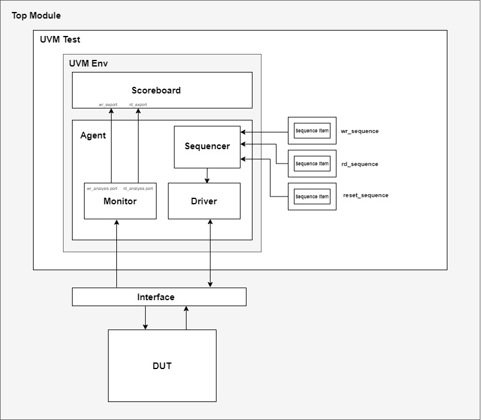

# FIFO Verification

## 1. Project Overview

FIFO stands for First In, First Out. It is a storage structure in which the first data written into the buffer is the first data read out. FIFOs are commonly used to temporarily store data between producer and consumer blocks, to absorb rate mismatches, and to support orderly data movement in digital systems.

This repository contains the verification environment of a generic synchronous FIFO. This verification environment can:

- generate FIFO traffic for reset, write, read, and simultaneous read/write operations
- drive `wr_en`, `rd_en`, and randomized `wr_data` into the DUT
- monitor `rd_data`, `fifo_empty`, and `fifo_full`
- compare read data against a reference queue inside the scoreboard
- check empty behavior when the reference queue becomes empty
- check full behavior when the reference queue reaches FIFO capacity
- collect functional coverage for read, write, data, and status conditions

## FIFO Design

The DUT is a single clock FIFO with parameterized data width and depth. It accepts write requests through `wr_en` and `wr_data`, accepts read requests through `rd_en`, and reports status using `fifo_empty` and `fifo_full`.

## Parameter Configuration

The key parameters are:

- `DATA_WIDTH = 32`
- `FIFO_SIZE = 101`

In this repository, the interface and DUT are instantiated with these parameter values:

- `fifo_intf #(DATA_WIDTH, FIFO_SIZE)`
- `fifo #(.FIFO_SIZE(FIFO_SIZE), .DATA_WIDTH(DATA_WIDTH))`

This means the environment currently verifies:

- a 32-bit wide FIFO
- a FIFO depth of 101 entries

## 3. Verification Architecture

Below is the architecture diagram for this project:

Key Components

- Agent: contains the sequencer, driver, and monitor for FIFO stimulus and observation
- Driver: converts sequence items into `reset`, `wr_en`, `rd_en`, and `wr_data` activity
- Sequencer: supplies transactions to the driver
- Monitor: passively samples read side and write side FIFO activity
- Scoreboard: compares observed `rd_data` against a reference queue and checks `fifo_empty` and `fifo_full`
- Coverage Collector: samples read, write, status, and data coverage points
- DUT: parameterized FIFO RTL connected to the UVM environment through `fifo_intf`

## 4. FIFO Signals

The signal list below summarizes the main bus signals relevant to this repository.

| Signal | Direction | Description |
| --- | --- | --- |
| `clk` | Input | Clock used to synchronize FIFO operations |
| `reset` | Input | Resets FIFO pointers, output data, and status behavior |
| `wr_en` | Input | Enables a write into the FIFO when it is not full |
| `rd_en` | Input | Enables a read from the FIFO when data is available |
| `wr_data` | Input | Data written into the FIFO |
| `rd_data` | Output | Data read out from the FIFO |
| `fifo_empty` |Output | Indicates that the FIFO has no readable data |
| `fifo_full` | Output | Indicates that the FIFO cannot accept more writes |

## 5. Test Suite

At present, the repository contains the following tests:

| Test Name | Description |
| --- | --- |
| `fifo_read_test` | Applies reset, writes data into the FIFO, performs repeated reads, and checks FIFO empty behavior. |
| `fifo_randomized_test` | Applies reset, then runs randomized bursts of write, read, and simultaneous read/write transactions. |
| `fifo_directed_test` | Runs a directed mix of reset, long write bursts, long read bursts, overflow-style pressure, and simultaneous read/write operations. |

## 6. How to Run

- Open ModelSim/QuestaSim
- `cd verification/sim`
- `do run.do`

The default test in `run.do` is `fifo_directed_test`. To run a different test, change the `+UVM_TESTNAME=` argument in the `run.do` file.
